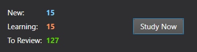
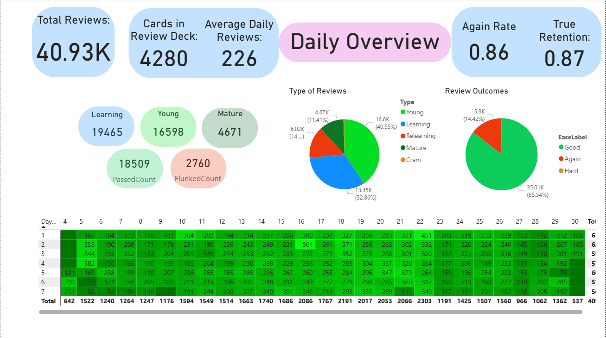
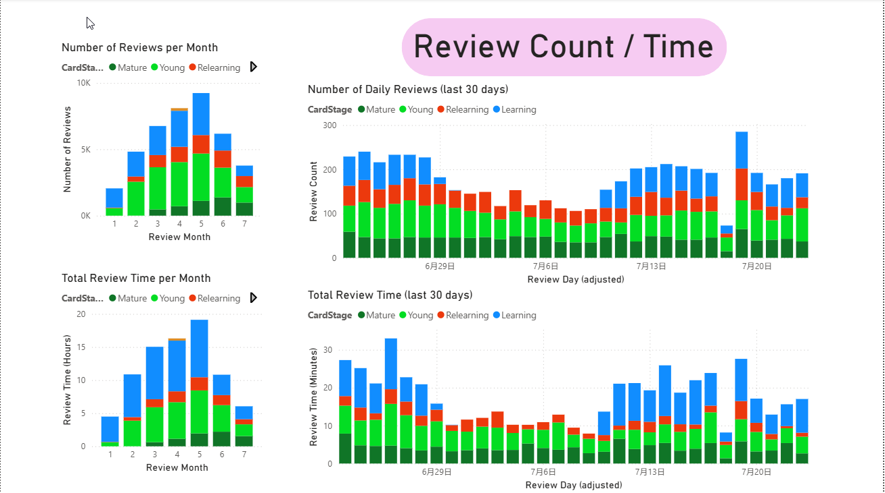
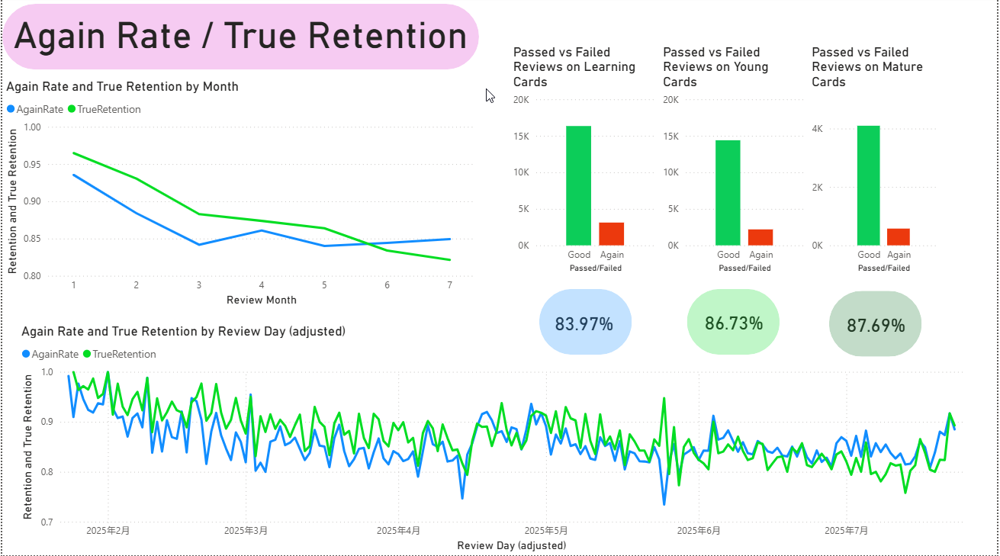
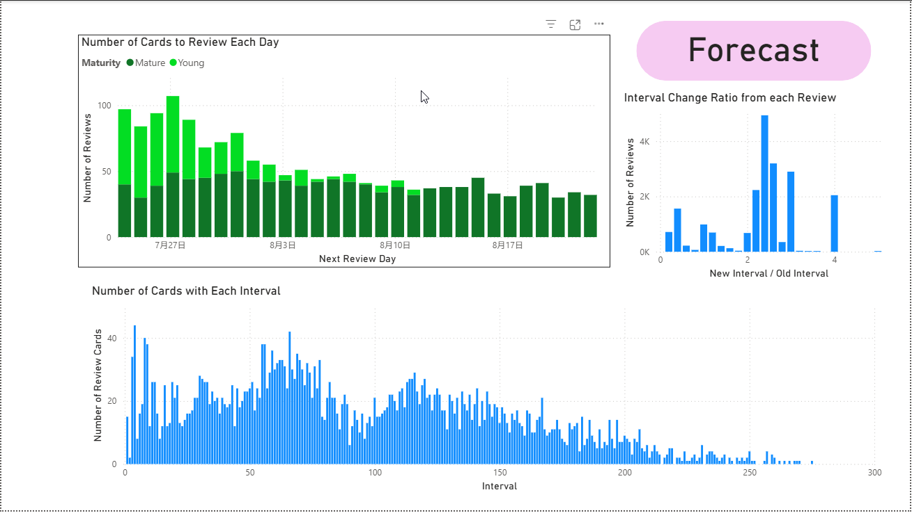

# Analysis of Anki Review Statistics Using Power BI 
This project is designed to show various statistics and data based on the flashcard reviewing application, Anki.
The project consists of a Power BI dashboard which visualises review data, displaying review key statistics including a detailed
breakdown of the number of reviews, card retention rates, card maturity and review intervals, time spent reviewing material in the
application and a forecast of future material yet to be reviewed.

## About Anki
Anki is an open-source flashcard programme that allows the user to create, share and review flashcards. 

### How Reviews Work
* The application schedules a number of cards to be reviewed.
* Users grade the difficulty of the card by selecting one of four options (Again, Easy, Good, Hard)
* Anki reschedules the next review based on the user's input.
* New Cards pass through the following stages: New -> Learning -> Young -> Mature

The user can also set a number of new, unseen cards to add to their daily reviews.

### Anki Queues
Cards are divided into three queues. 
* The "New" Queue contains unseen cards.
* The "Due" Queue contains previously seen cards that need to be reviewed.
* The "Learning" Queue contains cards that Anki thinks the user doesn't know. This includes cards that the user pressed Again whilst reviewing (known as a lapse) and cards from the new queue that have not yet graduated into the Due Queue.

The functionality of these queues and the requirements for new and lapsed cards to graduate from the Learning Queue can be set by the user.

### Card Maturity
If the user passes the card (i.e. rates the card as anything but again), the review interval grows.
* Young Cards have Interval < 21 days
* Mature Cards have Interval ≥ 21 days

For more information on how Anki schedules reviews, please see the Anki Manual [1].

## Project Overview
The data visualised here consists of data obtained from my personal usage of Anki from January 2025 to July 2025. The deck is a modified
version of the publicly available "JLPT-N5-N1 Japanese Vocabulary" deck available here [2]. In summary, the cards in this deck have a
Japanese word or phrase on one side and an English definition on the back. The goal is to try to recall the English definition when given the
Japanese word. All data on cards and reviews is kept in an SQL database which was exported for the purpose of this project. The Power BI
dashboard is split into 4 sections in order to efficiently visualise the data.

### Daily Overview
The first page shows an overview of general statistics regarding reviews. 
* Interactive heatmap shows the number of reviews per day.
* Pie Charts showing the total number of each type of review and how the review was graded.
* Various statistics including total number of reviews, detailed breakdown of type of review and grading of "Due Reviews", Again Rate and True Retention. These can be refined by day and week using the heatmap.

### Review Count / Time
The second page shows historic review count and time spent reviewing.
* Two stacked bar charts showing review count per day (last 30 days) and per month, separated by review type.
* Total time spent reviewing per day (last 30 days) and per month, separated by review type.

### Again Rate / True Retention
The third page shows information about again rate and true retention.
* Monthly again rate and true retention average.
* Passed vs Failed reviews for new/learning, young and mature cards.
* Again rate and true retention each day.

### Forecast
The fourth page shows various metrics forecasting reviews in the future.
* Forecast of reviews scheduled for the next 20 days separated by maturity.
* Histogram of Interval Shift for each card, showing the interval growth rates from each review.
* Count of the number of cards with each interval.

## How the Data was Obtained
Data is from my personal Anki usage. 

1. Exported Data using the Anki PC application to get a .apkg file.
2. Unzipped file to access collection.anki21 which contains an SQL Database
3. Exported data from the file using DB Browser for SQLite [3] as various .csv files.
4. Imported data into Power BI and used DAX to produce relevant visualisations and metrics.

> For those wishing to use their own data, depending on the version of Anki being used, the database may be found in collection.anki2 instead. collection.anki21 is for newer versions of Anki. 

## How to use this project.
If you are an Anki user, feel free to clone this repository or download the Power BI file and import your own exported data. Please follow Steps 1 to 3 above to obtain your own review data and then replace the files in the "data" folder with your own data files.

 > Please note, Anki allows users to change when a new day rolls over in Preferences. Please make sure that the day rolls over at the correct hour by checking the Config table in the model. This project allows for a rollover at 4.00am.

If you need help with the Anki's database structure, a detailed breakdown of the columns can be found here [4].

##

## Glossary
A glossary of key terms for this report:

Review: The act of grading a card with one of four options "Again", "Hard", "Good", "Easy".

Lapse / Flunked Review: The act of answering "Again" to a review card.

Interval: The amount of time between an initial and future review (in days for due cards, seconds for learning cards and new cards).

Queue: The group that cards are placed in. "New" for unseen cards, "Due" for review cards, "Learning" for unseen but not yet learnt cards and lapsed review cards.

Learning Review: Any review of a card that has not yet graduated to the Due Queue.

Relearning Review: A review of a previously lapsed card.

Cram Review: A review that takes place outside the normal schedule.

## Citations
[1] https://docs.ankiweb.net/

[2] https://ankiweb.net/shared/info/1550984460

[3] https://sqlitebrowser.org/

[4] https://github.com/ankidroid/Anki-Android/wiki/Database-Structure

## Summary
This project has allowed me to:
* Further investigate my study patterns in Anki.
* Improved my ability to use DAX to calculate relevant measures, columns and tables.
* Extract data from SQL databases.
* Visualise data in an intuitive and insightful way.

